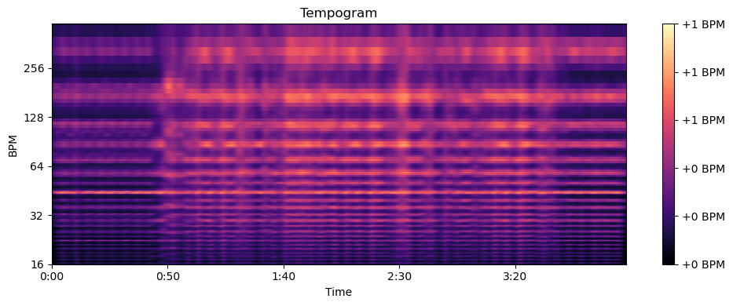
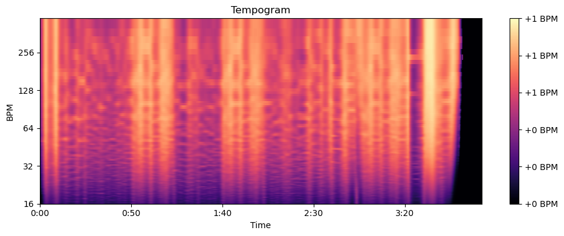
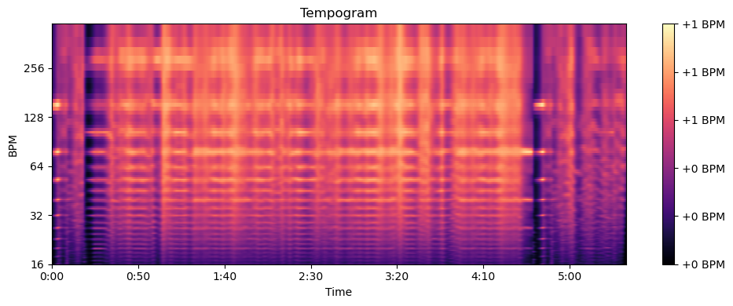
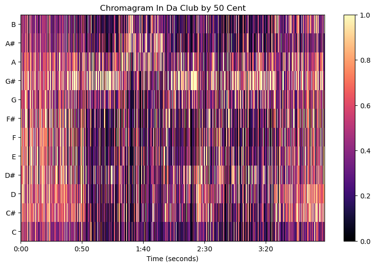
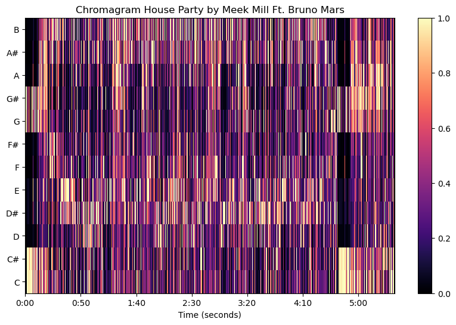
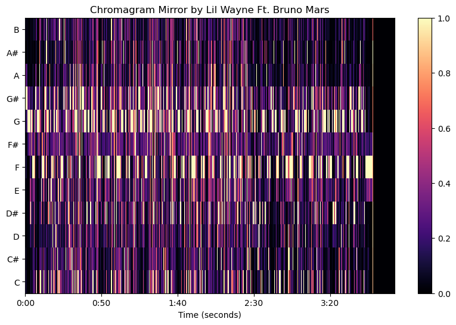

```{r, include=FALSE}
library(httr)
library(jsonlite)
library(tidyverse)
library(magrittr)
library(flexdashboard)
library(lubridate)
library(ggplot2)
library(dplyr)
library(knitr)


# Access the Spotify API
client_id <- "3b10e6d1bcae4ded910f9e311b861087"
client_secret <- "fe30f35f80384ca2851353cefffa9f01"
token_url <- "https://accounts.spotify.com/api/token"

auth_token <- POST(token_url,
                  authenticate(client_id, client_secret),
                  body = list(grant_type = "client_credentials"),
                  encode = "form")

token <- content(auth_token)$access_token

# Retrieve the data
playlist_id <- "1c2XZ1mY40deSOH7ukWlpe"
playlist_url <- paste0("https://api.spotify.com/v1/playlists/", playlist_id)

playlist_response <- GET(playlist_url,
                         add_headers(Authorization = paste("Bearer", token)))

playlist_data <- content(playlist_response)

track_ids <- playlist_data$tracks$items %>% map_chr(~ .$track$id)

# Process and analyze the data
track_features_url <- "https://api.spotify.com/v1/audio-features"

track_features_response <- GET(track_features_url,
                               add_headers(Authorization = paste("Bearer", token)),
                               query = list(ids = paste(track_ids, collapse = ",")))

track_features_data <- content(track_features_response)$audio_features

# Prepare data for the dashboard
track_release_years <- playlist_data$tracks$items %>% map_chr(~ .$track$album$release_date)

track_data <- as.data.frame(do.call(rbind, track_features_data))
track_data$release_year <- track_release_years[1:nrow(track_data)]

track_data$release_year <- as.numeric(substr(track_data$release_year, 1, 4))
track_data$tempo <- as.numeric(track_data$tempo)
track_data <- track_data %>% drop_na()

# Create the tempo chart
tempo_chart <- ggplot(track_data, aes(x = "", y = tempo)) +
  geom_violin(fill = "#7EB26D", alpha = 0.7, adjust = 0.2) +
  labs(title = "Tempo Distribution",
       x = "", y = "Tempo (BPM)") +
  theme_minimal()

# Convert danceability, energy, and loudness to numeric format
track_data$danceability <- as.numeric(track_data$danceability)
track_data$energy <- as.numeric(track_data$energy)
track_data$loudness <- as.numeric(track_data$loudness)

# Boxplot for danceability
danceability_boxplot <- ggplot(track_data, aes(x = "", y = danceability)) +
  geom_boxplot(fill = "#7EB26D", alpha = 0.7) +
  labs(title = "Danceability Boxplot",
       x = "", y = "Danceability") +
  theme_minimal()

# Boxplot for loudness
loudness_boxplot <- ggplot(track_data, aes(x = "", y = loudness)) +
  geom_boxplot(fill = "#8e44ad", alpha = 0.7) +
  labs(title = "Loudness Boxplot",
       x = "", y = "Loudness (dB)") +
  theme_minimal()

# Boxplot for energy
energy_boxplot <- ggplot(track_data, aes(x = "", y = energy)) +
  geom_boxplot(fill = "#f1c40f", alpha = 0.7) +
  labs(title = "Energy Boxplot",
       x = "", y = "Energy") +
  theme_minimal()

# Create Russell's Circumplex Model of Affect plot
track_data$valence <- as.numeric(track_data$valence)
track_data$energy <- as.numeric(track_data$energy)
track_data$tempo <- as.numeric(track_data$tempo)

affect_data <- track_data %>%
  select(valence, energy, tempo)

affect_plot <- ggplot(affect_data, aes(x = valence, y = energy, size = tempo)) +
  geom_point(alpha = 0.7) +
  xlim(0, 1) +
  ylim(0, 1) +
  labs(x = "Valence",
       y = "Energy",
       size = "Tempo (BPM)") +
  theme_minimal() +
  coord_cartesian(xlim = c(0, 1), ylim = c(0, 1)) +
  geom_hline(aes(yintercept = 0.5), linetype = "dashed", color = "gray") +
  geom_vline(aes(xintercept = 0.5), linetype = "dashed", color = "gray")

print(affect_plot)


# Ensure duration_ms is numeric
track_data$duration_ms <- as.numeric(track_data$duration_ms)

# Create bins for track durations
track_data$duration_bins <- cut(track_data$duration_ms / 1000, breaks = seq(0, max(track_data$duration_ms / 1000), by = 10), include.lowest = TRUE, right = FALSE, labels = FALSE)

# Convert the bin numbers to the desired format (e.g., "150 - 159")
track_data$duration_bins <- paste((as.numeric(track_data$duration_bins) - 1) * 10, (as.numeric(track_data$duration_bins) * 10) - 1, sep = " - ")

# Create a bar chart of track durations
duration_plot <- ggplot(track_data, aes(x = duration_bins)) +
  geom_bar(fill = "orange", alpha = 0.7) +
  labs(title = "Track Duration",
       x = "Duration (seconds)", y = "Number of Tracks") +
  theme_minimal() +
  theme(axis.text.x = element_text(angle = 45, hjust = 1)) +
  scale_y_continuous(breaks = seq(0, max(table(track_data$duration_bins)), by = 1))

print(duration_plot)


```
Introduction
=====================================


I’ve chosen a playlist called “old skuul HipHop” which I created myself, soon after I created my Spotify account. It’s called old skuul (old school) because it is a playlist full of my favorite Hip-Hop songs growing up as a kid/teenager. It consists of a variety of artist from a wide range of time (approximately from 1990 till 2010), and different forms of Hip-Hop, with the exclusion of my favorite Hip-Hop artist Eminem. That is because I created a different playlist with just his music.

The playlist has a big variety of Hip-Hop songs for various reasons. The first reason is that since the songs all come from a different time, there are a lot of different artists, with most of the time just one song in this playlist. This is because I only add the ones I really liked when I listened to their music. Only the Big names such as Tupac, B.I.G, 50 Cent etc. have multiple songs in this playlist. All the songs are recorded, so no live performance in this playlist.

I expect to find that all the songs are indeed from the same genre, and that there is a big probability that people who like one song, might like more songs from this playlist. The most typical songs in the playlist are: 50 Cent - In Da Club / Meek Mill - House Party / Lil Wayne Featuring Bruno Mars - Mirror.


With this assignment I expect to learn more about the playlist I listen to very often, and will find out whether my assumptions regarding this playlist can be confirmed with the use of the Spotify Data. I expect to find out that the music is loud and energetic, but with a lot of "outliers" where quit a lot (approximately 25%) songs who are not within the range of the median, since Hiphop music has a lot of varations.


The tempo distribution
=====================================

Column{data-width=750}
-----------------------------------------------------------------------
```{r}
tempo_chart
```

Column {data-width=250}
-----------------------------------------------------------------------
This violin plot shows the distribution of tempo for tracks in the entire playlist. The tempo distribution is continuous, with a peak around 95 BPM. This indicates that the majority of the songs in the playlist have a tempo close to 95 BPM, which is also the expected BPM for Hiphop songs (based on my findings on the internet). What stands out is that I expected tracks with a higher BPM, I did not expect songs with a BPM of 200! This is something I really did not expect, because from my own experience most songs feel like they are within the same tempo. However there are songs in this playlist which feel like "house" music, but I always assumed that this was the case because of the melody (which I associate with EDM).


Tempo
=====================================

row {data-width=300}
-----------------------------------------------------------------------
```{r}

```

In Da Club - 50 Cent

In the first tempogram we can see that through the whole song the tempo is constant. The only visible difference is just before the 50 seconds mark, which if you listen to the song you can hear 50 cent pick up the pace of him rapping (just a little bit).


row {data-width=300}
-----------------------------------------------------------------------
```{r}

```

The second tempogram is from Mirror - Lil Wayne Feat. Bruno mars. In this one you can see a lot more change throughout the song. For example the beginning and the mark after 50 seconds and after 1 min 40 seconds, you can see a similarity in the tempogram. this comes because at exact these stimestamps the melody changes a bit and Bruno Mars starts singing the chorus of the song. But then the part after 3 min 30 seconds is different because then it is not Lil Wayne rapping but Bruno Mars singing, which explains the difference.


row {data-width=300}
-----------------------------------------------------------------------
```{r}

```

The final tempogram is that of House Party - Meek Mill. In this tempogram you can see there is a clear melody which keeps repeating itself throughout the whole song, which is exactly as expected, since it's a party hiphop song (as I would describe it).


The danceability / energy / loudness
=====================================

row {data-width=300}
-----------------------------------------------------------------------
```{r}
danceability_boxplot
```

**danceability_boxplot:** This boxplot illustrates the distribution of danceability scores for the tracks in the playlist. Danceability scores range from 0 (least danceable) to 1 (most danceable). The median danceability score is around 0.7, indicating that the majority of the tracks in the playlist have high danceability. The Boxplot for danceability has a quit small range (compared my other boxplots), which suggest that most songs fall within the "median" range. Suggesting that most songs in my playlist have a good danceability score, which is quit ironic, since I can't imagine dancing on most of the songs in my playslist.

row {data-width=300}
-----------------------------------------------------------------------
```{r}
energy_boxplot
```

**energy_boxplot:** The energy boxplot shows the distribution of energy scores for the tracks in the playlist. Energy scores also range from 0 (least energetic) to 1 (most energetic). The median energy score is around 0.6, suggesting that the playlist contains tracks with moderate to high energy. In contrast with the danceablility boxplot, the energy boxplot has a bigger wider varation in energy levels. According to Spotify:"Energy is a measure from 0.0 to 1.0 and represents a perceptual measure of intensity and activity. Typically, energetic tracks feel fast, loud, and noisy." this is something I can relate to since there is a lot going on in the my old school Hiphop playlist, in terms of the pace most rappers "rap" in to sound more intimidating, or better said as a "Boss" (Meek Mill - I'm a boss).

row {data-width=300}
-----------------------------------------------------------------------
```{r}
loudness_boxplot
```

**loudness_boxplot:** This boxplot displays the distribution of loudness values for the tracks in the playlist. Loudness is measured in decibels (dB). The median loudness value is around -6 dB, indicating that the playlist's tracks are relatively loud. The range of loudness values is also quite wide, suggesting a variety of loudness levels across the playlist. This is somewhat not surprising at all, because I like it when the music is loud with a strong base sound. 


Energy, Valance and tempo
=====================================
row {data-width=300}
-----------------------------------------------------------------------
```{r}
affect_plot
```

affect_plot: The affect plot is based on the Russell's Circumplex Model of Affect, where each point represents a track with its valence and energy values on the x and y axes. The plot reveals that the majority of the tracks have moderate to high energy and valence scores. And according to Spotify Valance means the following:"A measure from 0.0 to 1.0 describing the musical positiveness conveyed by a track. Tracks with high valence sound more positive (e.g. happy, cheerful, euphoric), while tracks with low valence sound more negative (e.g. sad, depressed, angry)". This suggests that the playlist primarily consists of energetic and positive-sounding tracks. This is quit surprising since I would never assume that my playlist would be "positive' sounding tracks, because I mainly focus on the lyrics and the beat and the feeling the music gives me, which is energetic, but not necessarily positive. However, I did expect to see more songs with low energy, and seeing this made me realize that Hiphop (from my list) actually gives good "party vibes", and even though it uses explicit words in the song, it apparently has is way more positive then negative/angry.

Duration
=====================================

row {data-width=300}
-----------------------------------------------------------------------
```{r}
duration_plot
```

Duration_plot: The duration plot showcases the distribution of track lengths in the playlist. The barchart shows the amount of tracks that take an x amount of seconds. Now we can see that most songs take between 190 - 199 seconds till 310 - 319 seconds. With the most tracks being 220 - 229 seconds long and 250 - 259 seconds long (both have 10 songs with the same duration). What you can see as well is that there are a couple songs which have a duration that is more then double the median duration (Runaway - Kanye west = +500 seconds). But except from this outlier most songs are within the range where a songs duration is approximately 3 minutes (with still quite alot songs longer than 3).


Chroma
=====================================

row {data-width=300}
-----------------------------------------------------------------------
```{r}

```

In Da Club - 50 Cent
The top 3 most used pitch classes are:
G#, A & D

row {data-width=300}
-----------------------------------------------------------------------
```{r}

```

House party - Meek Mill
The top 3 most used pitch classes are:
D#, B & E

row {data-width=300}
-----------------------------------------------------------------------
```{r}

```

Mirror - Lil wayne Feat. Bruno Mars
The top 3 most used pitch classes are:
G, F & G#


-----------------------------------------------------------------------

Comparing the chromograms for all 3 songs, which in my opinion, are the 3 songs that provide the best overview for my corpus provide a good overview of what notes are used for the different 'type' of hiphop songs. However I did not expect the 3 songs to have almost no similarity in the notes they used. the only similair used not is G# (most used for In Da Club, and 3th for Mirror). Another thing to note is that there are not huge shifts in any of the songs when it comes to the notes used, except for House Party by Meek mill, where in the beginning there are only 4 notes played. Another thing is the difference in notes used for both In Da CLub & House Party versus Mirror. This is somewhat expacted since Mirror is the calmest of the 3 songs.


Conclusion
=====================================

Having a great passion for music, but no musical knowledge at all made this assignment quite difficult but fun at the same time. Playing (more struggling) with the API and the data gave me a lot of insight in my own playlist which I still like to listen to today. I'm quit happy with the results I could generate except my problem with creating a matrix or chroma, which for some reason would not work for me. Which is of course my own fault because I started a bit to late with this assignment. But other then that I have learned a lot about working with R and visualizing the data collected from my own Spotify playlist with my taste of music.

Before I started I assumed that the visuals would confirm what I expected from my expectations, which was true for some cases like danceablilty, tempo en energy. But at the same the I did not expect songs that would jump out so for from the median with the tempo. The most surprising finding for me was that my playlist can be seen as "positive", which I would never believe if I did to create the affect plot myself. This is probably because the lyrics in the songs are quit "dark" as in they are aggressive in the words they use (a lot of swearwords). But overall I think I've learned a lot about my taste in Hiphop. The difference in the tempograms did not surprise me at all since I have a lot of different kinds of hiphop. The same goes for the chromaplot. Since there are hiphop songs which tell a story and there are hiphop songs that are there as party music, I could not say that I was surprised.

This playlist contains a lot of memories for me, because it contains music I grew up listening to, and still love to listen to today. The fact that I could have a deep dive into my own music, and learn about the music I love to listen to was really fun. Even though I struggled a lot with  understanding the meaning of each terms was, since I had no background in music, I can say that I learned something which I never would have wouldn't it for this assignment. The only part what I did not like was the struggle I had with creating the dashboard, even though I did most of the data camp training, I couldn't get it as I would like. Had I more time, I would first fix the Timbre and chroma issue I had, and after the aesthetics of my dashboard, because I know that I wanted something better for a project I liked doing.


